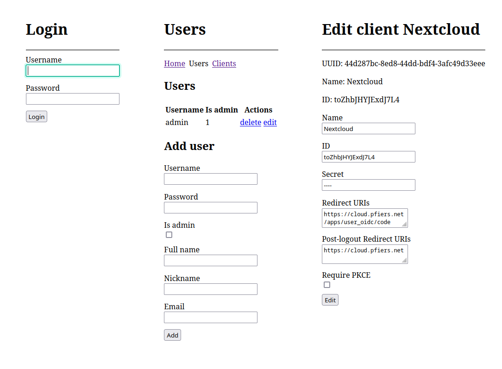

# Tijmid

**Home-crafted identity and [OpenID Connect](https://openid.net/connect/) server**

Created as a personal challenge to learn about OAuth & OIDC. Deployed as the
identity server for my self-hosted apps. Because it's completely custom, it has
some neat features like:
- A command-line interface for managing users and clients (used by my server
  automation/provisioning scripts)
- Automatic key creation (JWKS and JWT)
- Native support for nginx's
  [auth_request](https://docs.nginx.com/nginx/admin-guide/security-controls/configuring-subrequest-authentication/)
  module
- ~~FIDO 2.0 / WebAuthn~~: *will be adding this when I get my YubiKey*

Uses [Node.js](https://nodejs.org/), [Express](https://expressjs.com/),
[SQLite3](https://github.com/WiseLibs/better-sqlite3), and
[node-oidc-provider](https://github.com/panva/node-oidc-provider). 

  

As a kind of detox from modern frontend development it has an ultra-minimal UI: 

